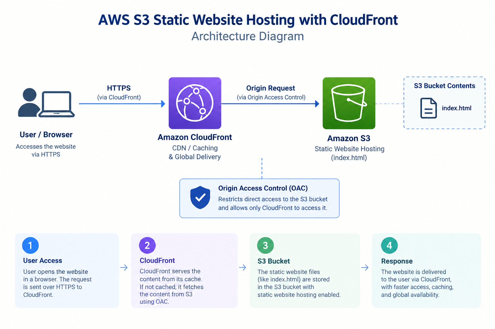

# AWS S3 Static Website Hosting with CloudFront

## Project Overview

This project demonstrates static website hosting using Amazon S3 and
content delivery through Amazon CloudFront.

## AWS Services Used

- Amazon S3
- Amazon CloudFront
- IAM

## Project Implementation

1. Created an Amazon S3 bucket.
2. Uploaded the `index.html` file.
3. Enabled static website hosting.
4. Configured bucket access.
5. Created a CloudFront distribution.
6. Connected CloudFront with the S3 bucket.
7. Tested the hosted website.

## Architecture

## Project Flow

User / Browser
→ Amazon CloudFront
→ Amazon S3
→ `index.html`

CloudFront provides caching and content delivery, while Amazon S3 stores
the static website files.

## Skills Demonstrated

- Amazon S3
- Amazon CloudFront
- Static Website Hosting
- IAM
- Cloud Basics
- CDN
- AWS Console Configuration
- Troubleshooting